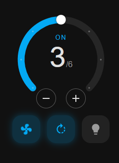

# Fan Speed Card

[![GitHub Release][releases-shield]][releases]
[](https://hacs.xyz/docs/faq/custom_repositories)

[](https://ko-fi.com/davbuild/?amount=1)

[releases-shield]: https://img.shields.io/github/release/davbuild/fan-speed-card.svg?style=for-the-badge
[releases]: https://github.com/davbuild/fan-speed-card/releases

Lovelace card for Home Assistant to control a `fan` entity with on/off, rotation direction and 6 speeds, styled after the built-in thermostat card.

Works with any `fan` entity that supports speed (`percentage`) and, optionally, direction.

<p align="center">
  
</p>

## Features

- Circular 270° dial with one step per speed — tap or drag to set it
- `−` / `+` buttons to change speed one step at a time
- **State** chip: turn the fan on or off
- **Direction** chip: switch between forward and reverse (hidden if the entity doesn't support it)
- Optional **Light** chip for the fan's light: tap to toggle, long-press to open the light's more-info dialog
- Icon-only buttons that light up (fan, direction, light); the direction button turns **red** when the fan runs in reverse (it only lights up while the fan is on)
- Animated fan icon that spins faster with the speed and follows the rotation direction (can be turned off with `animate_icon: false`)
- Keyboard support (arrow keys) and follows your Home Assistant theme (light/dark)
- Configurable number of speeds (default 6)
- Multi-language support (ES, EN, FR, DE, PT, IT, NL, CA, PL) plus Home Assistant's own translations for states and direction

## Installation via HACS

[](https://my.home-assistant.io/redirect/hacs_repository/?owner=davbuild&repository=fan-speed-card&category=lovelace)

Or manually:

1. HACS → **(⋮)** → Custom repositories
2. URL: `https://github.com/davbuild/fan-speed-card`
3. Category: **Lovelace**
4. Search for **Fan Speed Card** and install
5. Reload Lovelace

### Manual installation (without HACS)

1. Copy `fan-speed-card.js` to `/config/www/`
2. Settings → Dashboards → ⋮ → **Resources** → add `/local/fan-speed-card.js` as a *JavaScript module*
3. Reload the browser

## Configuration

```yaml
type: custom:fan-speed-card
entity: fan.living_room
```

```yaml
type: custom:fan-speed-card
entity: fan.living_room
name: Living room fan   # optional
speeds: 6               # optional
light_entity: light.living_room_fan   # optional, adds the Light chip
animate_icon: false     # optional, stop the fan icon from spinning
```

| Option | Required | Default | Description |
|--------|:--------:|---------|-------------|
| `entity` | ✅ | — | The `fan.*` entity to control |
| `name` | ❌ | — | Small title shown above the dial |
| `speeds` | ❌ | auto (entity `percentage_step`, else `6`) | Number of speed steps on the dial |
| `light_entity` | ❌ | — | A `light.*`, `switch.*` or `input_boolean.*` entity (e.g. the fan's light). Adds a **Light** button: tap toggles it, long-press opens its more-info dialog |
| `animate_icon` | ❌ | `true` | Set to `false` to keep the fan icon still instead of spinning |
| `language` | ❌ | auto | Force a language (e.g. `es`, `en`, `fr`). By default the Home Assistant user language is used |

## Supported languages

Auto-detected from your Home Assistant profile. Force with `language: en`.

ES · EN · FR · DE · PT · IT · NL · CA · PL

The state ("On", "Off", "Unavailable") and direction values are taken from Home Assistant's own translations, so they appear in **every language Home Assistant supports**. The card's own labels (State, Direction, button tooltips) are translated into the languages above; any other language falls back to English.

## How speeds work

Each step maps to a percentage: `step × (100 / speeds)`, or the entity's own `percentage_step` attribute when it provides one. For a 6-speed fan the steps are 17 %, 33 %, 50 %, 67 %, 83 % and 100 %. The card calls:

| Action | Service |
|--------|---------|
| Set speed 1–6 | `fan.set_percentage` |
| Turn on / off (also speed 0) | `fan.turn_on` / `fan.turn_off` |
| Change direction | `fan.set_direction` |

## Example: ceiling fan exposed as separate MQTT entities

Some fans (for example a Realtek **RTL87X0C** board flashed with MQTT firmware) don't show up in Home Assistant as a single `fan` entity. The device page looks like this instead:

- **Controls:** two switches, *Light* and *Fan*
- **Configuration:** four number inputs, *Direction*, *Mode*, *Timer* and *Speed*
- **Sensors:** a generic read-only value

There is no `fan.*` entity, so a card that needs one has nothing to control. The fix is to describe the same MQTT topics as a proper [MQTT fan](https://www.home-assistant.io/integrations/fan.mqtt/) in `configuration.yaml`:

```yaml
mqtt:
  fan:
    - name: "Ventilador Techo"
      unique_id: "ventilador_techo_rtl_01"
      # on / off
      state_topic: "VentiladorTecho/4/get"
      command_topic: "VentiladorTecho/4/set"
      payload_on: "1"
      payload_off: "0"
      optimistic: false
      # speed: the device uses 1–6
      percentage_state_topic: "VentiladorTecho/5/get"
      percentage_command_topic: "VentiladorTecho/5/set"
      speed_range_min: 1
      speed_range_max: 6
      # direction: the device uses 1 = forward, 0 = reverse
      direction_state_topic: "VentiladorTecho/6/get"
      direction_command_topic: "VentiladorTecho/6/set"
      direction_value_template: "{{ 'reverse' if value == '0' else 'forward' }}"
      direction_command_template: "{{ '0' if value == 'reverse' else '1' }}"
```

What each part does:

| Setting | Purpose |
|---------|---------|
| `state_topic` / `command_topic` + `payload_on` / `payload_off` | The device's on/off topic (`…/4/…`). It reports and accepts `1` and `0`. |
| `percentage_*_topic` | The speed topic (`…/5/…`). Home Assistant works in percentages, so with `speed_range_min: 1` and `speed_range_max: 6` it translates between 17 % … 100 % and the device's speeds 1…6. |
| `direction_*_topic` | The direction topic (`…/6/…`). The device uses `1` and `0`, Home Assistant uses `forward` and `reverse`; the two templates convert between them. |
| `optimistic: false` | The state shown comes from what the device reports, not from what was sent. |

The topic numbers (`4`, `5`, `6`) and the `1`/`0` meanings belong to this particular device. Adapt them to yours, and reload the MQTT entities (or restart Home Assistant) after editing. The original switches and number inputs can stay as they are, or be hidden.

Once the `fan.ventilador_techo` entity exists, the card works with it directly. Use the existing *Light* switch for the light button:

```yaml
type: custom:fan-speed-card
entity: fan.ventilador_techo
light_entity: switch.ventilador_techo_luz   # the "Light" switch of the device
```

Because the speed range is 1–6, the card's `speeds: 6` default matches the fan with no further configuration.

## Theming

The accent color of the dial follows `--state-fan-active-color` and falls back to `--primary-color`. Text and background use the standard Home Assistant theme variables.

## Requirements

- Home Assistant 2023.9+
- A `fan` entity with speed support (direction support is optional)
- HACS (only for the HACS install)

## License

MIT
